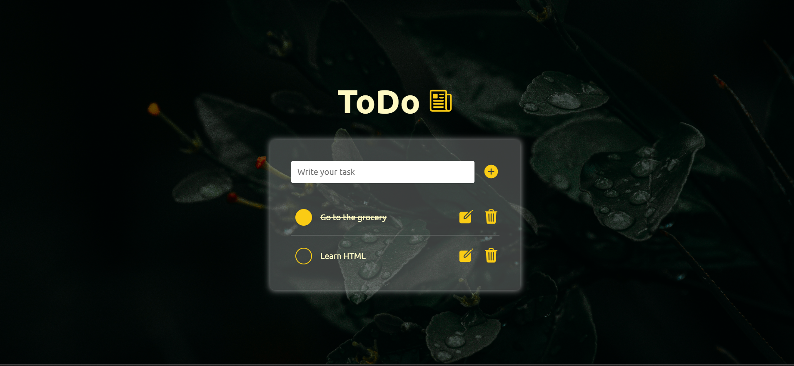

<div align="center">
 <h2 align="center">TODO Project-1</h2>
 
</div>

<!-- Bagdes -->
<div align="center">
  <!-- Profile -->
  <a href="https://github.com/SkAliya">
    
  </a>
  <!-- Status -->
    <a href="#">
    
  </a>
</div>

<div align="center">



</div>

<h2 align="center">Links</h2>

- Live Site URL: [Live Demo](https://voluble-flan-7ba6e2.netlify.app/)

<br>

<!-- Bagdes -->


- Semantic HTML5 markup
- CSS3
- SASS
- JAVASCRIPT

## Author

- GITHUB - [@SkAliya](https://github.com/SkAliya)

### Run the project

```bash
npm install
npm run compile:sass
live-server
```
