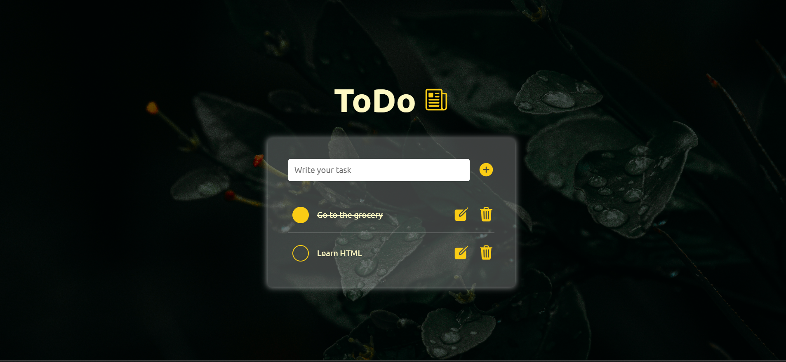
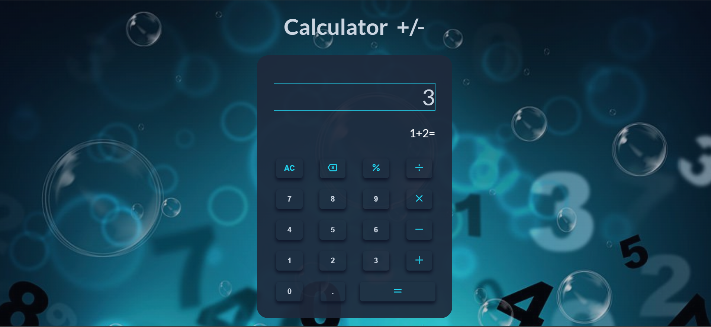
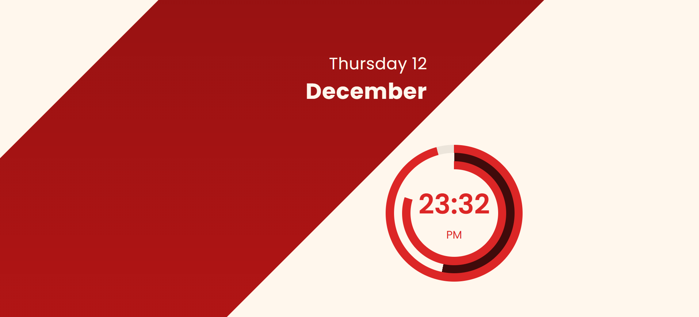
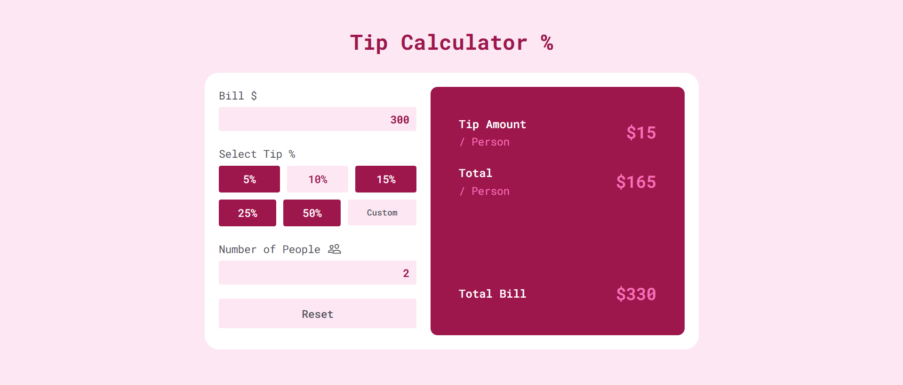

<h1 align='center'>$\color{lime}{\textrm{JAVASCRIPT - PROJECTS}}$</h1>

 <!--<h3 align="center" style="color:'green'">This repo contains all JavaScript projects🗃️ from Newbie🌱 to Advance 🚀.</h1>-->
<h2 align="center" >$\color{lime}{\textrm{This repo 🗃️ contains all JavaScript projects  from Newbie 🌱 to Advance 🚀}}$</h2>

 <h2 align="center">Project-1</h2>

 

 
 
 
 

  

Live Site URL: [Live Demo](https://leafy-empanada-416b13.netlify.app/)

 <h2 align="center">Project-2</h2>

 

 
 
 
 

  

Live Site URL: [Live Demo](https://reliable-pie-e5bc31.netlify.app/)

 <h2 align="center">Project-3</h2>

 

 
 
 
 

  

Live Site URL: [Live Demo](https://deft-belekoy-3ed5d7.netlify.app/)

 <h2 align="center">Project-4</h2>

 

 
 
 
 

  

Live Site URL: [Live Demo](https://astonishing-mousse-806c3f.netlify.app/)

